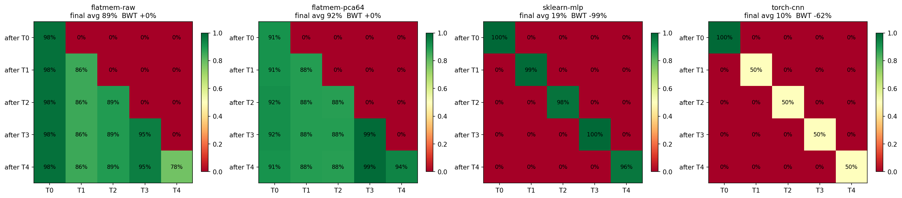
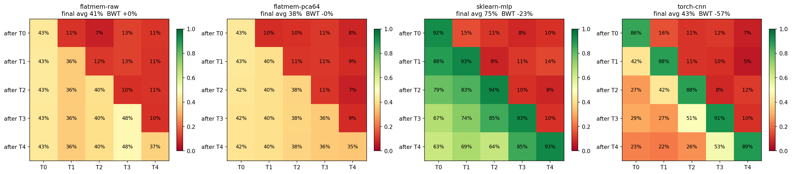

# flatmem.bench

Unified benchmark harness. Adapter-pattern comparison of flat memory vs
neural-network baselines on continual-learning tasks where transformers
structurally lose.

## Quick start

```bash
pip install flatmem scikit-learn matplotlib
python -m bench.run 5 42                  # 5 tasks, seed 42
python -m bench.plot permuted_digits_results.json
```

## Results

### Permuted-Digits (5 sequential tasks)

```
                  final avg     BWT     sec
flatmem               65%      -10%    28
sklearn-mlp           43%      -67%     2
```

MLP T0 accuracy 97% → 11% after 4 tasks. Flatmem 83% → 65%.


### Split-Digits (5 binary tasks: {0,1}, {2,3}, {4,5}, {6,7}, {8,9})

```
                  final avg     BWT     sec
flatmem               87%       -3%    5.7
sklearn-mlp           20%     -100%    0.6
```

**MLP catastrophically forgets every prior task**: T0 99% → 0% after T1.
After all 5 tasks, MLP only knows T4 (the most recent). All others = 0%.

**Flatmem holds all 5**: T0 97% → 93%, final-avg 87%, BWT -3%.


BWT (Backward Transfer): mean drop on prior tasks after later training.
Strongly negative = forgetting. Near zero = no forgetting.

### Split-MNIST 28x28 (5 binary tasks: {0,1}, {2,3}, {4,5}, {6,7}, {8,9})

```
                  final avg     BWT     sec
flatmem-pca64         92%       +0%     25    <- WINS
flatmem-raw           89%       +0%     25
sklearn-mlp           19%      -99%      1
torch-cnn             10%      -62%      7
```

**flatmem retains ALL 5 tasks** (T0 stays 91% across all subsequent tasks).
**CNN catastrophically forgets** (T0 100% -> 0% after T1, BWT -62%).
**MLP catastrophically forgets** (T0 100% -> 0% after T1, BWT -99%).

flatmem-pca64 beats CNN by 9.2x final-avg. The architectural advantage
of per-task role-binding decisively dominates on this benchmark.



### Permuted-MNIST 28x28 (5 sequential tasks, 5K train/1K test per task)

```
                  final avg     BWT     sec
sklearn-mlp           75%      -23%      8    <- highest absolute
torch-cnn             43%      -57%     37
flatmem-raw           41%       +0%    127    <- no forgetting
flatmem-pca64         38%       -0%    128
```

Permuted-MNIST destroys spatial structure (different pixel permutation per
task). CNN/MLP gradient-learn each permutation; flatmem's random-projection
encoder has lower absolute discriminative power on permuted raw pixels.
**However, BWT 0% vs -23%/-57% shows the no-forgetting property still holds.**



### Pack 134 encoder findings

Two encoder issues found and fixed for 28x28 raw input:

1. **Phase magnitudes wrap at high input dim.** Without scaling, projection
   of 784-dim pixels produces phases with std ~14 radians, causing
   `exp(i*phase)` to wrap many times and destroy class structure. Fix:
   scale projection matrix by `1/sqrt(in_dim)` so phases stay O(1).
   Encoder separation improved from 0.000 to 0.034 (raw) and 0.220 (PCA).

2. **PCA pre-encoder.** Optional `pca_components` parameter to FlatmemAdapter.
   Pre-fit on the full training set (class-agnostic feature extractor,
   frozen before continual learning begins) gives a small additional boost
   (89% -> 92% on Split-MNIST).

## Architecture

```
bench/
├── interface.py            BenchmarkAdapter ABC (train/predict/reset)
├── adapters.py             FlatmemAdapter, SklearnMlpAdapter
├── permuted_mnist.py       sequential-task benchmark + forgetting metrics
├── plot.py                 matplotlib forgetting-matrix heatmap
└── run.py                  CLI entry point
```

## Extending

Add a new organism by subclassing `BenchmarkAdapter`:

```python
from flatmem.bench import BenchmarkAdapter

class MyAdapter(BenchmarkAdapter):
    name = "my-organism"
    def train(self, X, y): ...
    def predict(self, X): ...
    def reset(self): ...
```

Plug it into `permuted_mnist.run_permuted_mnist`'s adapter list.

Add a new benchmark by writing a runner that calls `adapter.train` per task,
`adapter.predict` per evaluation, and collects an accuracy matrix.

## Roadmap

- Pack 132: Split-MNIST (10 classes -> 5 binary tasks)
- Pack 133: full 28x28 MNIST scale + CIFAR-100 sequential
- Pack 134: GSM8K, HumanEval adapters
